# movie-data-comms
Dashboard showcasing trends in a TMDb movie dataset.

Will be updated later to get cleaned up and include more information (including pictures!)

----

# Home
*Outlining the goals for the project, examining the dataset, and predicting future extensions.*

# Top films
*What trends exist amongst the top films in the database?*

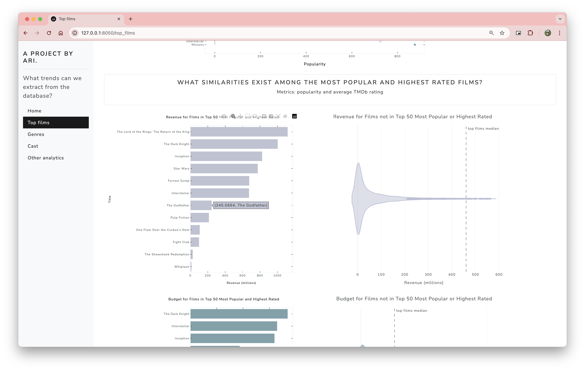

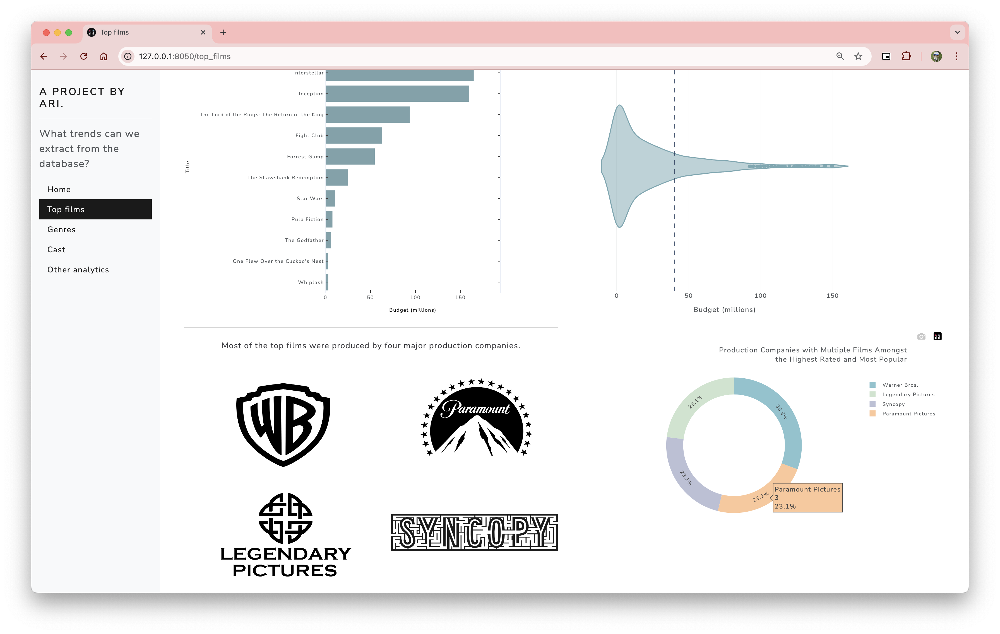

# Genres
*Are there any genres which perform better than others?*
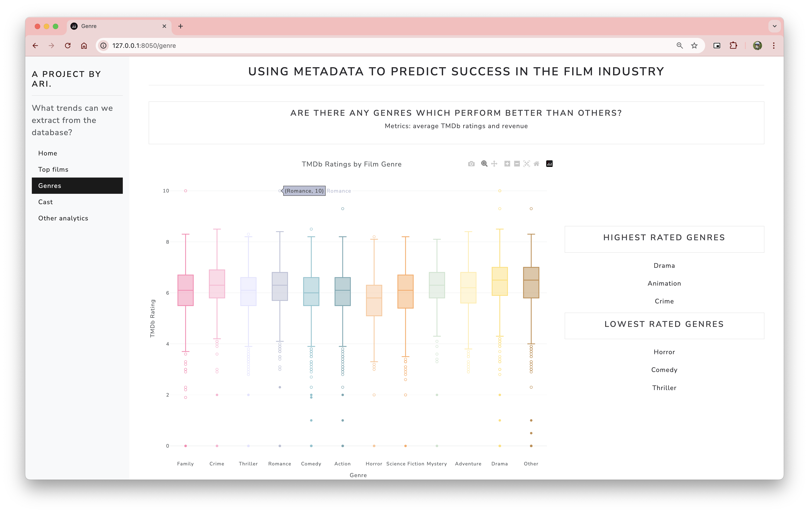
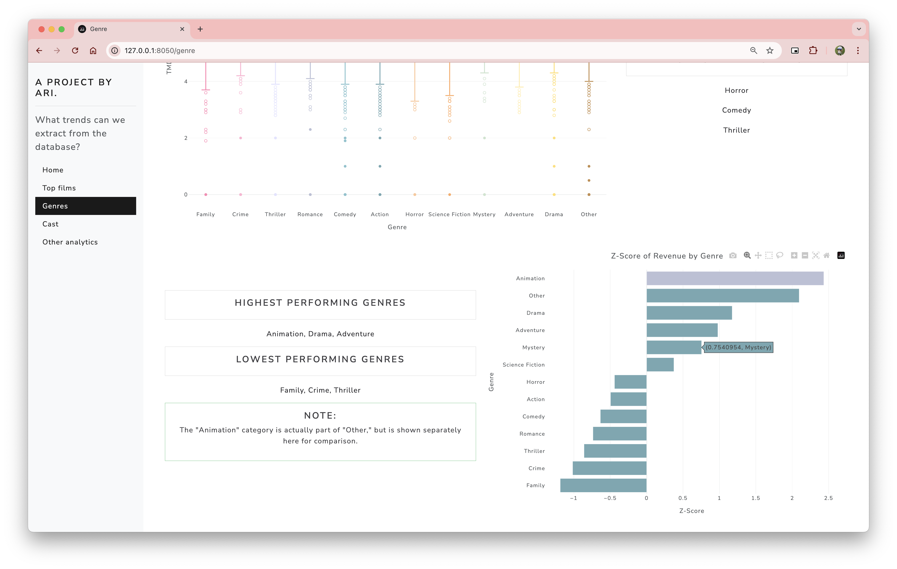

# Cast
*How important is it to have a highly accomplished cast?*
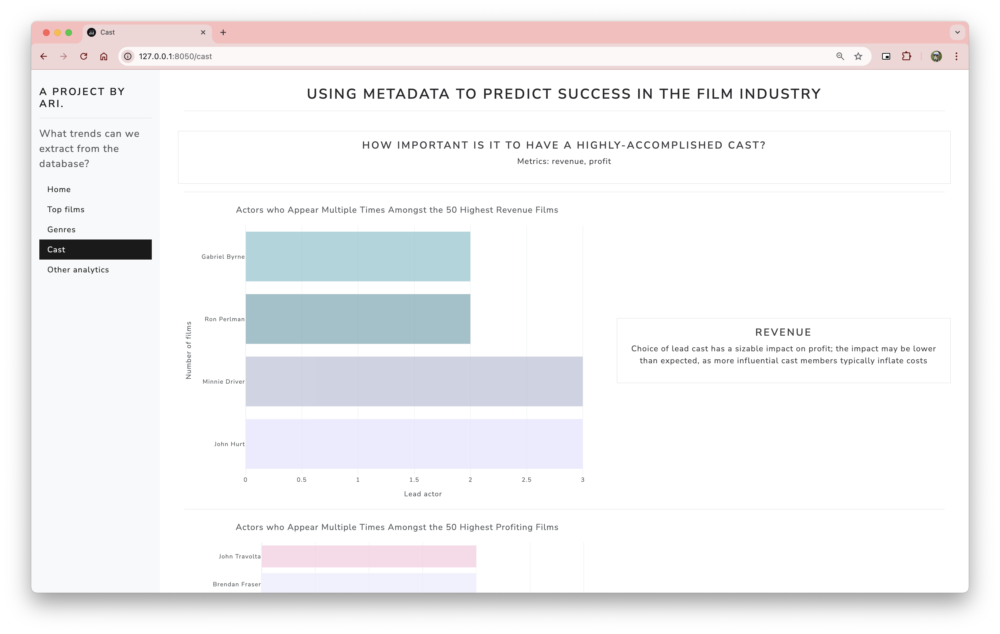
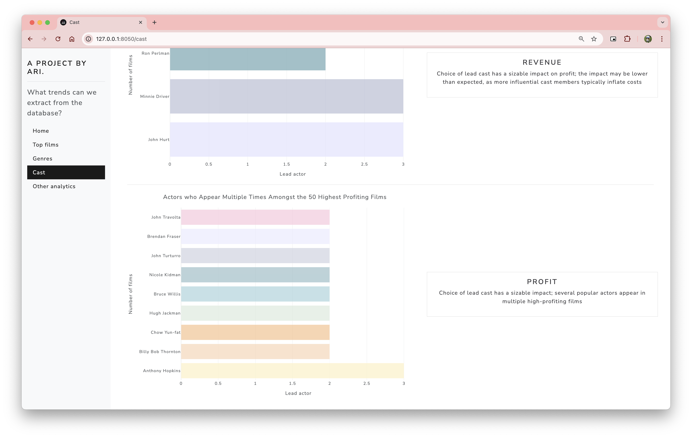

# Other analytics
*What are some other interesting and more complex analyses we can gather from the database?*
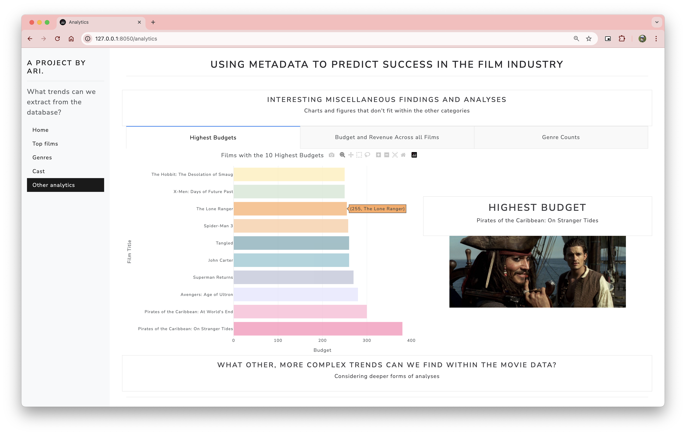
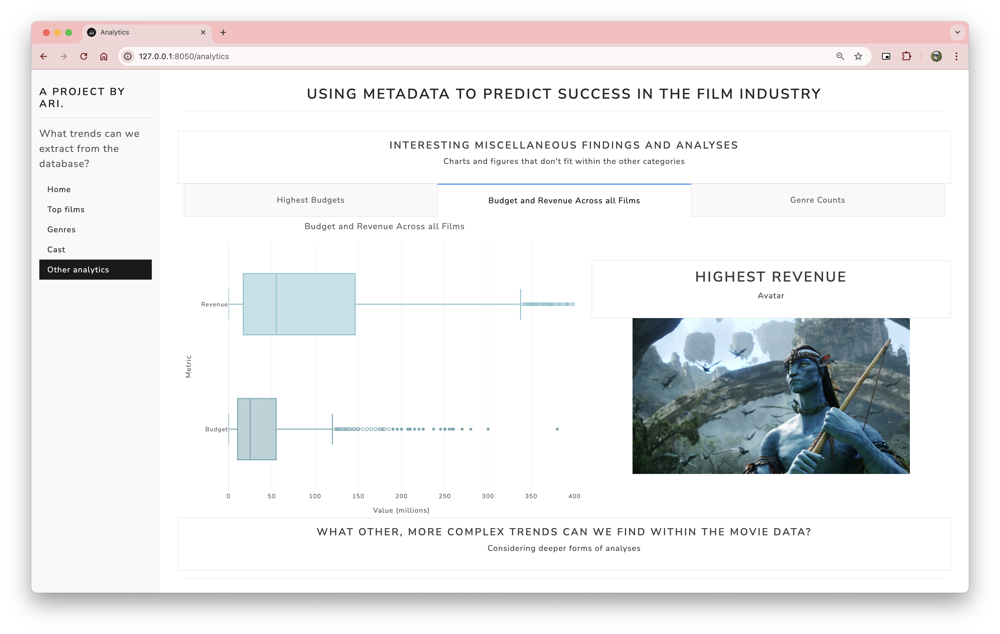
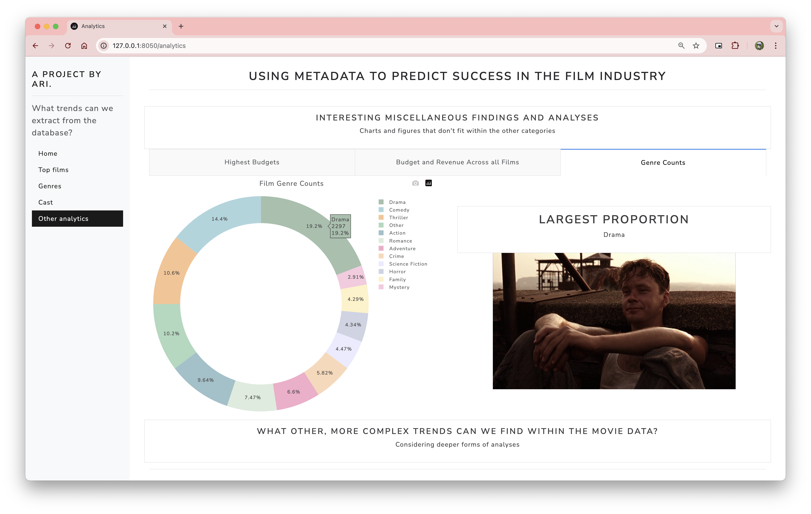

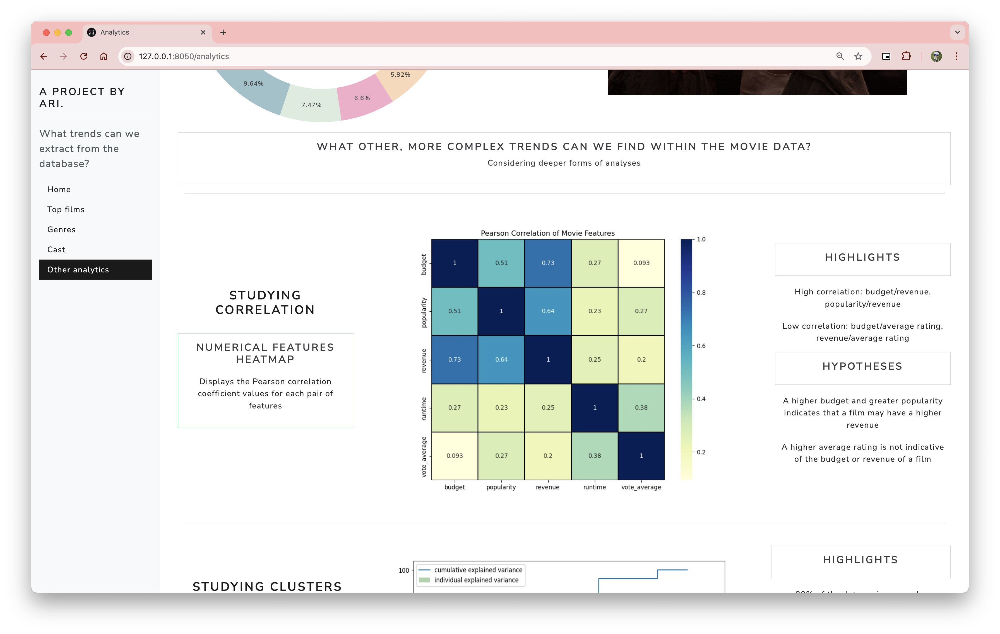
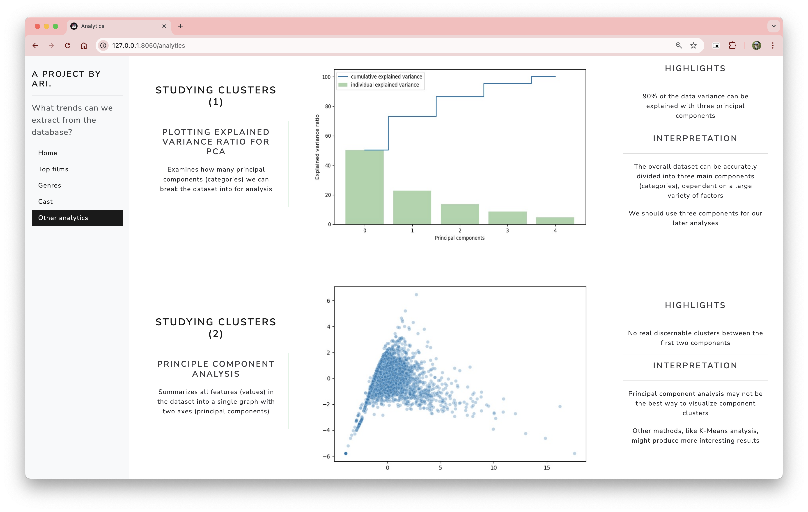
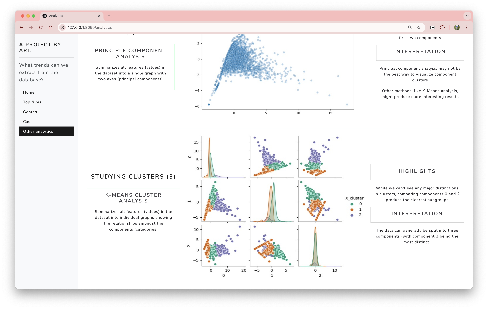

